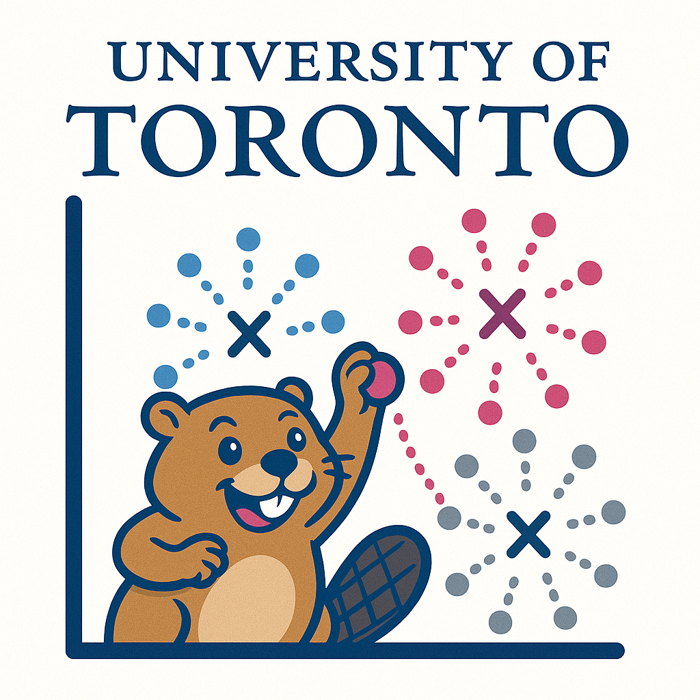

```{r setup, include=FALSE}
source("./_aux/links_supplementary.R")
source("./_aux/week01.R")
source("./_aux/week02.R")
source("./_aux/week03.R")
source("./_aux/week04.R")
source("./_aux/week05.R")
source("./_aux/week06.R")
source("./_aux/week07.R")
source("./_aux/week08.R")
source("./_aux/week09.R")
source("./_aux/week10.R")
source("./_aux/week11.R")
source("./_aux/week12.R")
```


::: {#header}
<span class="header-title">`r course_code`: `r course_full_name`<br></span>
<span class="header-subtitle">`r university`<br>`r department`<br>`r season` `r year`</span>

::: {#header-image .img}

::: 
:::


This course is designed as an *in-person* course aimed at introducing the theories and algorithms of Artificial Intelligence. Topics include a subset of:
search, game playing, game theory, planning, reasoning and decision making with uncertainty, computational perception,
and applications of Artificial Intelligence. Assignments provide practical experience of the core
topics.


## Course Staff

::: {#shuffleleft-container .col .sec}

::: instructorphoto

:::
::: instructorphoto

:::
::: instructorphoto

:::
::: instructorphoto

:::


:::


::: sechighlight
::: {#logistics .container .sec}
## Logistics
- **Instructor:** Erfan Meskar 
- **Lectures:** 
  - **Monday:** 9:00 AM - 11:00 AM, Room SW 309.
- **Tutorials:** 
  - **TUT0101:** Tuesday, 11:00 AM - 12:00 PM, Room IC 308
  - **TUT0102:** Tuesday, 3:00 PM - 4:00 PM, Room AA 206
  - **TUT0103:** Tuesday, 4:00 PM - 5:00 PM, Room MW 264
- **Office hours:**
  - Erfan Meskar ([Zoom](https://utoronto.zoom.us/j/83099743199)): Monday 1:00 PM – 3:00 PM
  - Malhar Pandya ([Zoom](https://utoronto.zoom.us/j/87002764450)): Thursday 4:00 PM - 5:00 PM
  - Ali Parchekani ([Zoom](https://utoronto.zoom.us/j/89752425282)): Monday 6:00 PM – 8:00 PM
- **Contact**: 
  - Students should ask *all* course-related questions in course Piazza 
  channels. <br>
  - For personal matters only, email instructor.
-   **Announcements:** All announcements will be made in Piazza.
:::
:::


::: {#coursework .container .sec}
## Coursework
  - **Programming Assignments (40%)**
    - There will be 4 assignments, each is worth 10%.
    - These must be done individually and submitted on MarkUs. The submission deadline will be Sunday night (11:59 PM).
  - **Problem Sets (10%)**
    - You will complete five problem sets, each worth 2%.
    - These must be done individually. Problem sets must be submitted on MarkUs, and the submission deadline will be Sunday night (11:59 PM).
  - **Midterm  (15%)**
    - The midterm is a closed book, 75-minute exam, and scheduled on Feb. 26.
    - It will test the content of the weeks before the test. 
  - **Final Exam (35%)**
    - The final exam is closed book, comprehensive, 3 hours, and held during the exam period. 
    - You must obtain at least 40% on the final exam to pass the course; otherwise, your final course grade will be set no higher than 47%.

All (currently tentative) deadlines are listed in the [schedule](#schedule). 
Note that **due dates may change** based on how the course is progressing.
:::

::: {#submitting .container .sec}
##  Submitting Coursework
- Do not submit your coursework via email.
- If anything goes wrong, please ask a question in Piazza or contact a course 
assistant.
- You can submit as many times as you'd like until the deadline: we will only 
grade the last submission.
- Partial work is better than not submitting any work.
:::

::: {#latedays .container .sec}
## Late Days
- 15% for each day up to day 3 – after 3 days the value is zero.
:::

::: {#sylremark .container .sec}
## Regrade Requests

Regrade requests for Programming Assignments, Problem Sets, 
and Midterm are due within 1 week of receiving the graded work and must be 
submitted by posting a private question on Piazza.

  - We ask that you carefully review your assignments, reflect, and write a 
  short explanation justifying the reasons for a regrading request.
  - If a grade is contested and we realize that the marker made a mistake in the
  student's favour, the mark for that assignment may be lowered when the mistake
  is found. This would otherwise create a situation which is unfair to other
  students.
  - Please include your full name and UTORid in the body of the private note.
:::

::: {#rectextbook .container .sec}
## Recommended Textbooks

  - **R&N:** Russel and Norvig, "Artificial Intelligence: A Modern Approach", 4th edition.
  - **P&M:** Poole and Mackworth, "Artificial Intelligence – Foundations of Computational Agents",
3rd edition. Available free on-line [here](https://artint.info/).
:::

::: {#schedule .container .sec}

## Course Schedule

|Week | Topics        | Readings    |  Tutorials  | Coursework
|:----|:--------------|:------------|:------------|:-----------------
|1    | `r w01_top`   | `r w01_rea` |  `r w01_wsh`| `r w01_crw`               
|2    | `r w02_top`   | `r w02_rea` |  `r w02_wsh`| `r w02_crw`  
|3    | `r w03_top`   | `r w03_rea` |  `r w03_wsh`| `r w03_crw`              
|4    | `r w04_top`   | `r w04_rea` |  `r w04_wsh`| `r w04_crw`             
|5    | `r w05_top`   | `r w05_rea` |  `r w05_wsh`| `r w05_crw`              
|6    | `r w06_top`   | `r w06_rea` |  `r w06_wsh`| `r w06_crw`
|Reading Week
|7    | `r w07_top`   | `r w07_rea` |  `r w07_wsh`| `r w07_crw`              
|8    | `r w08_top`   | `r w08_rea` |  `r w08_wsh`| `r w08_crw`              
|9    | `r w09_top`   | `r w09_rea` |  `r w09_wsh`| `r w09_crw`              
|10   | `r w10_top`   | `r w10_rea` |  `r w10_wsh`| `r w10_crw`              
|11   | `r w11_top`   | `r w11_rea` |  `r w11_wsh`| `r w11_crw` 
|12   | `r w12_top`   | `r w12_rea` |  `r w12_wsh`| `r w12_crw` 


:::
